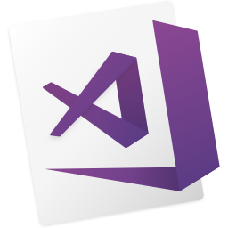

##       
# 𝙃𝙚𝙡𝙡𝙤, 𝙄'𝙢 ***SYED HASAN***

  
  
  

---

<h4 align="center">🔍 Looking for a top-tier Developer? 🔍</h4>
<h1 align="center">💥 Syed Hasan at Your Service 💥</h1>
<h3 align="center">🌟 Expert Full-Stack Web Developer (MERN) from Bangladesh 🌟</h3>

---

As a passionate Full-Stack Developer, I specialize in MERN-stack technology, boasting 4+ completed projects. I'm eager to bring my innovative and creative skills to your team, driving growth and success. Dive into my GitHub to explore my work, and let's connect to discuss how I can contribute to your next big project!

   

<h2 align="center" style="font-family: 'Segoe UI', Tahoma, Geneva, Verdana, sans-serif; color: #2c3e50;">
  🎉 **Welcome to My Personal Space!** 🎉
</h2>

<h3 align="center" style="font-family: 'Comic Sans MS', cursive, sans-serif; color: #e74c3c;">
  🌟 **Explore My Portfolio and Projects** 🌟
</h3>

  Check out my work and latest projects at <a href="https://myportfolio-4189a.web.app" style="color: #3498db; text-decoration: none;"><b>Syedhasan.web.app</b></a>. Dive into the world of web development and see what I’ve been up to!

<h3 align="center" style="font-family: 'Comic Sans MS', cursive, sans-serif; color: #e67e22;">
  🚀 **Currently Learning** 🚀
</h3>

  I’m on an exciting journey, exploring the depths of <b>Next.js</b> and <b>Redux</b> , <b>Framer Motion</b>, <b>Gsap</b>! 🚀 Always eager to expand my skill set and embrace new challenges.

<h3 align="center" style="font-family: 'Comic Sans MS', cursive, sans-serif; color: #9b59b6;">
  💬 **Ask Me About** 💬
</h3>

  I’m here to chat about <b>HTML</b>, <b>CSS</b>, <b>JavaScript</b>, <b>React</b>, <b>Node.js</b>, or <b>MongoDB</b>. Let's discuss, collaborate, and innovate together!

<h3 align="center" style="font-family: 'Comic Sans MS', cursive, sans-serif; color: #1abc9c;">
  📫 **How to Reach Me** 📫
</h3>

  Feel free to drop me a line at <a href="mailto:syedhasanmohammad@gmail.com" style="color: #3498db; text-decoration: none;"><b>syedhasanmohammad@gmail.com</b></a>. I’m always open to new opportunities and exciting conversations!

<h3 align="center" style="font-family: 'Comic Sans MS', cursive, sans-serif; color: #f39c12;">
  📄 **My Experiences** 📄
</h3>

  Discover my professional journey and achievements through my <a href="https://docs.google.com/document/d/1krGrvW1JpOpXv7olJlCQBev0IY28UBf8zjeBOVaRR6Q/edit?usp=drive_link" style="color: #3498db; text-decoration: none;"><b>Resume</b></a>. Let’s connect and make great things happen!

     
<h2 align="center">🔥 Languages & Frameworks & Tools & Abilities 🔥</h2>
 

 

  <code></code>
  <code></code>
  <code></code>
  <code></code>
  <code></code>
<!--   <code></code> -->
  <code></code>
  <code></code>
  <code></code>
  <code></code>
  <code></code>
  <code></code> 
  <code></code>
  <code></code>
  <code> 
  </code>
  <code>  </code>

<h2 align="center">Things I use on a daily basis</h2>
 

  

 
 

<!--  -->

<h2 align="center">⚡ Stats ⚡</h2>
 

 

 

 

